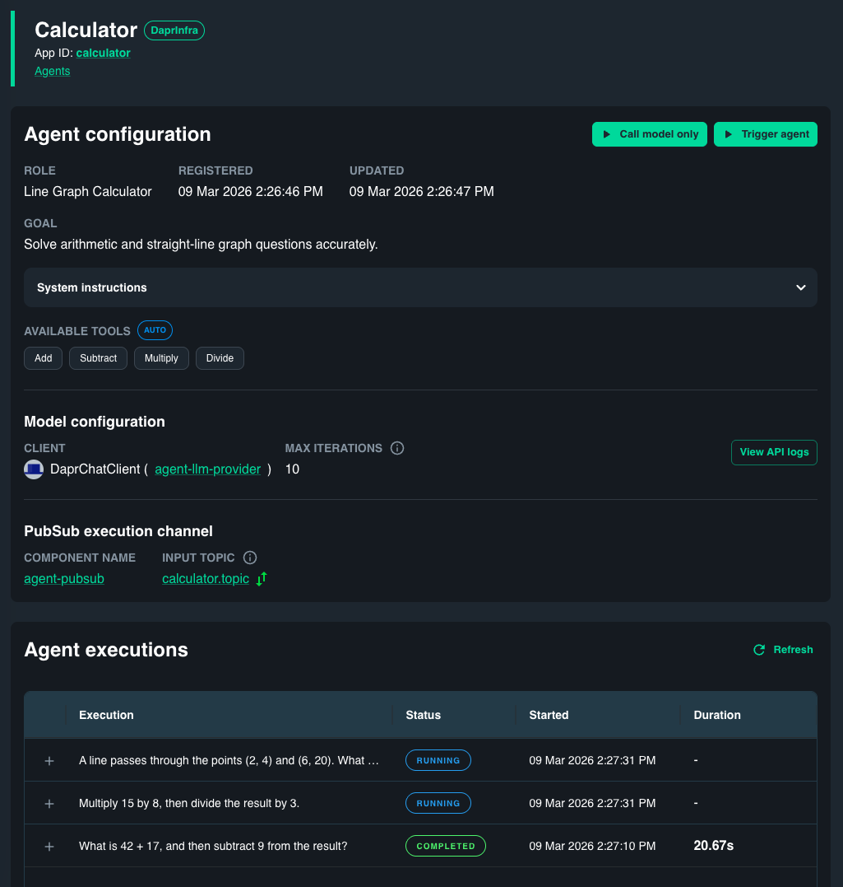

# Calculator

A durable calculator agent built on [Dapr Agents](https://diagrid.ws/dapr-agents-doc). This recreates the calculator use case from the [LangGraph quickstart](https://docs.langchain.com/oss/python/langgraph/quickstart), replacing graph state, nodes, conditional edges, and loop wiring with a few tools and one `DurableAgent`.

## How is this different to the LangGraph version?

The LangGraph calculator needs explicit graph plumbing — `MessagesState`, `llm_call` node, `tool_node`, `should_continue` edge function, graph compilation and loop wiring. This sample replaces all of that with four arithmetic tools, one `DurableAgent`, and one `AgentRunner`. On top of that, the agent exposes a REST endpoint and a Pub/Sub endpoint out of the box, and is fully durable — every step is backed by a workflow with automatic state persistence.

## Prerequisites

1. [Diagrid CLI](https://docs.diagrid.io/catalyst/references/cli-reference/overview)
2. [Python 3.11+](https://www.python.org/downloads/)
3. [uv](https://docs.astral.sh/uv/)
4. [OpenAI API key](https://platform.openai.com/api-keys)

## Setup

```bash
uv venv
source .venv/bin/activate
uv sync
```

Set your OpenAI API key in `resources/agent-llm-provider.yaml`.

## Run

```bash
diagrid dev run -f dapr.yaml
```

Addition and subtraction:

```bash
curl -X POST http://localhost:8001/agent/run \
  -H "Content-Type: application/json" \
  -d '{"task": "What is 42 + 17, and then subtract 9 from the result?"}'
```

Multiplication and division:

```bash
curl -X POST http://localhost:8001/agent/run \
  -H "Content-Type: application/json" \
  -d '{"task": "Multiply 15 by 8, then divide the result by 3."}'
```

Straight-line graph question:

```bash
curl -X POST http://localhost:8001/agent/run \
  -H "Content-Type: application/json" \
  -d '{"task": "A line passes through the points (2, 4) and (6, 20). What is the slope, and what is y when x = 10?"}'
```

## Catalyst

Log in to [Catalyst](https://catalyst.r1.diagrid.io/agents) to see the full agent — its configuration, interact with it, and see executions step-by-step including every LLM call and every tool call.


