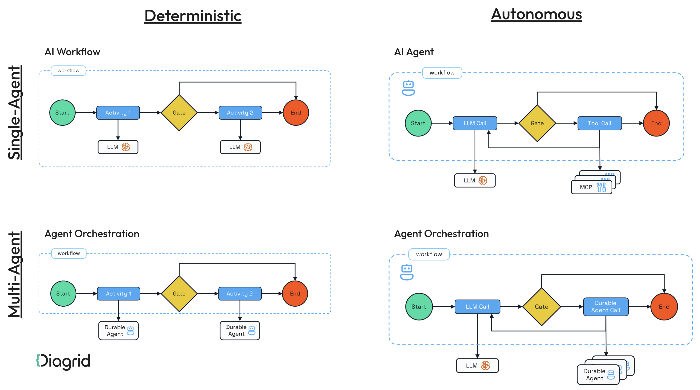
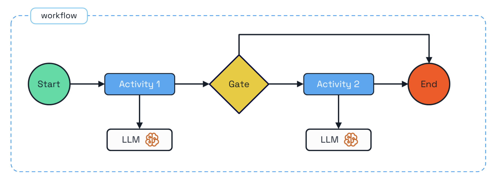
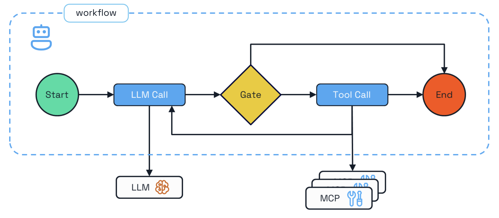
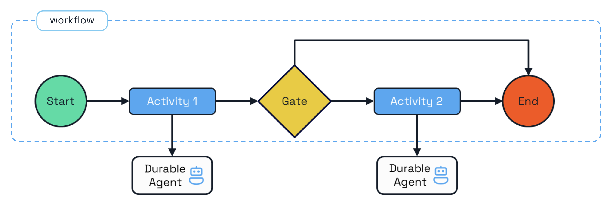
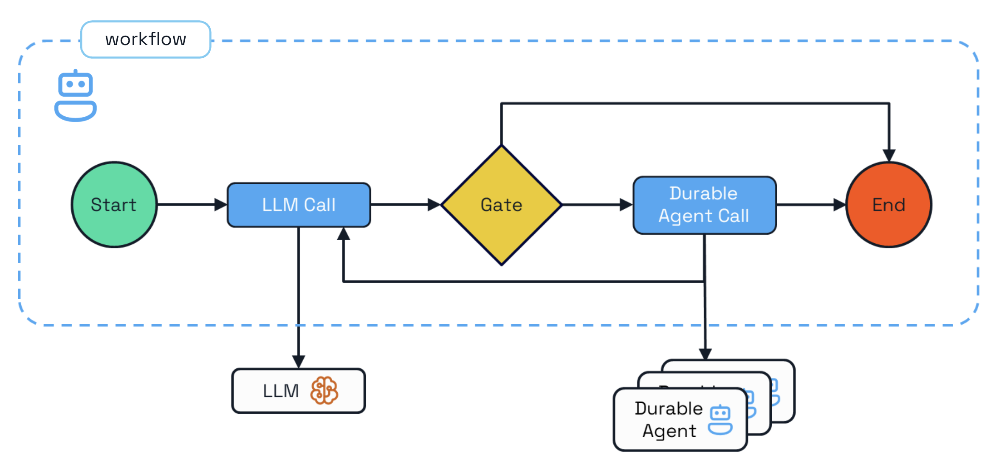

# Durable Agentic Patterns

Four patterns for building durable AI agents, applied to the same customer support use case. Each builds on the previous, progressively replacing coded control flow with LLM-driven decisions.



| # | Pattern | Control | Flexibility | Cost |
|---|---------|---------|-------------|------|
| 1 | [Workflow + LLM](#1-workflow--llm) | Fully deterministic | Low — hardcoded steps | Lowest — exactly 2 LLM calls |
| 2 | [Single Agent](#2-single-agent) | LLM-driven | Medium — adapts to input | Medium — variable LLM calls |
| 3 | [Multi-Agent Workflow](#3-multi-agent-workflow) | Deterministic coordination, intelligent agents | High — modular agents | Medium — 2 agent invocations |
| 4 | [Agent-Orchestrated](#4-agent-orchestrated) | Fully LLM-driven | Highest — dynamic discovery | Highest — orchestrator + agent LLM calls |

## Prerequisites

1. [Diagrid CLI](https://docs.diagrid.io/catalyst/references/cli-reference/overview)
2. [Python 3.11+](https://www.python.org/downloads/)
3. [uv](https://docs.astral.sh/uv/)
4. [OpenAI API key](https://platform.openai.com/api-keys)

## Setup

```bash
uv venv
source .venv/bin/activate
uv sync
```

Set your OpenAI API key in `resources/agent-llm-provider.yaml`.

---

## 1. Workflow + LLM

A deterministic Dapr Workflow that makes direct LLM calls to classify and resolve support tickets. No agents — just workflow activities calling an LLM.



- Two sequential LLM calls orchestrated by a Dapr Workflow
- Priority gate: only high-priority tickets get a detailed resolution
- Each LLM call is a checkpointed workflow activity (durable execution)

```bash
cd 1-workflow-llm
diagrid dev run -f dapr.yaml
# Or run locally with: dapr run -f dapr.yaml
```

High-priority ticket (triggers both LLM calls):

```bash
curl -X POST http://localhost:8001/workflow/start \
  -H "Content-Type: application/json" \
  -d '{"customer": "Alice", "issue": "Production system is completely down, no services responding."}'
```

Normal-priority ticket (classification only):

```bash
curl -X POST http://localhost:8001/workflow/start \
  -H "Content-Type: application/json" \
  -d '{"customer": "Bob", "issue": "How do I change my notification preferences?"}'
```

**How it works:** Receives a ticket via REST, classifies it with an LLM call, gates on priority, and generates a resolution with a second LLM call for high-priority tickets only.

### Why move to a single agent?

The workflow hardcodes the exact sequence (classify → gate → resolve). Any change requires code changes. The gate is binary — `if priority != "high"` — with no room for nuance. The agent can reason about edge cases (e.g. a "normal" ticket mentioning data corruption might still deserve escalation). **Trade-off**: you lose determinism — the workflow guarantees exactly 2 LLM calls in a fixed order.

---

## 2. Single Agent

A single durable agent that handles customer support tickets end-to-end. Instead of a deterministic workflow, the LLM decides which tools to call and in what order.



- LLM-driven execution flow (no coded gates)
- Tools for entitlement checking and environment lookup
- Durable execution with automatic state persistence

```bash
cd 2-single-agent
diagrid dev run -f dapr.yaml
# Or run locally with: dapr run -f dapr.yaml
```

Entitled customer (full resolution):

```bash
curl -X POST http://localhost:8001/agent/run \
  -H "Content-Type: application/json" \
  -d '{"task": "Customer Alice reports: My Dapr system fails to start in production. All services returning 503 errors."}'
```

Non-entitled customer (rejected):

```bash
curl -X POST http://localhost:8001/agent/run \
  -H "Content-Type: application/json" \
  -d '{"task": "Customer Bob reports: My Dapr system fails to start in production."}'
```

**How it works:** The agent checks entitlement, retrieves customer environment details, and generates a resolution — all driven by LLM reasoning over tool results.

### Why split into multiple agents?

One agent doing everything works, but it mixes concerns — triage logic and resolution logic share the same instructions, tools, and context. Splitting into specialized agents means each has a focused role, simpler prompts, and its own tools. Teams can own, test, and deploy each agent independently. The triage agent can be reused by other workflows. **Trade-off**: more moving parts — three apps instead of one, with network calls between them.

---

## 3. Multi-Agent Workflow

A Dapr Workflow that orchestrates two durable agents (triage and expert) as child workflows. The workflow controls the execution order; the agents handle the reasoning.



- Dapr Workflow calls agents as child workflows
- Triage agent checks entitlement and urgency
- Expert agent diagnoses and resolves the issue
- Deterministic orchestration with agentic execution

```bash
cd 3-multi-agent-workflow
diagrid dev run -f dapr.yaml
# Or run locally with: dapr run -f dapr.yaml
```

```bash
curl -X POST http://localhost:8003/workflow/start \
  -H "Content-Type: application/json" \
  -d '{"customer": "Alice", "issue": "My Dapr system fails to start in production."}'
```

**How it works:** The workflow calls the triage agent as a child workflow to check entitlement, then calls the expert agent to diagnose and resolve the issue.

### Why replace the workflow with an orchestrator agent?

The workflow hardcodes which agents to call and in what order. Adding a new specialist (e.g. billing-agent) requires code changes. An orchestrator agent discovers agents from a registry at runtime and delegates based on LLM reasoning — add a new agent and it can use it without redeployment. **Trade-off**: less predictable — the orchestrator might take extra turns or delegate inefficiently. More LLM calls means higher cost and latency.

---

## 4. Agent-Orchestrated

An orchestrator agent that discovers and delegates tasks to specialist agents via pub/sub messaging. No Dapr Workflow — the orchestrator agent decides what to delegate and when.



- Orchestrator agent uses `OrchestrationMode.AGENT` to coordinate
- Agents communicate via pub/sub messaging
- Dynamic agent discovery through agent registry
- Fully autonomous — the LLM drives all delegation decisions

```bash
cd 4-agent-orchestrated
diagrid dev run -f dapr.yaml
# Or run locally with: dapr run -f dapr.yaml
```

```bash
curl -X POST http://localhost:8003/agent/run \
  -H "Content-Type: application/json" \
  -d '{"task": "Customer Alice reports: My Dapr system fails to start in production. Check her entitlement, assess urgency, and provide a resolution."}'
```

**How it works:** The orchestrator discovers available agents via the registry, delegates to the triage agent and expert agent via pub/sub, and synthesizes results into a customer-friendly response.
