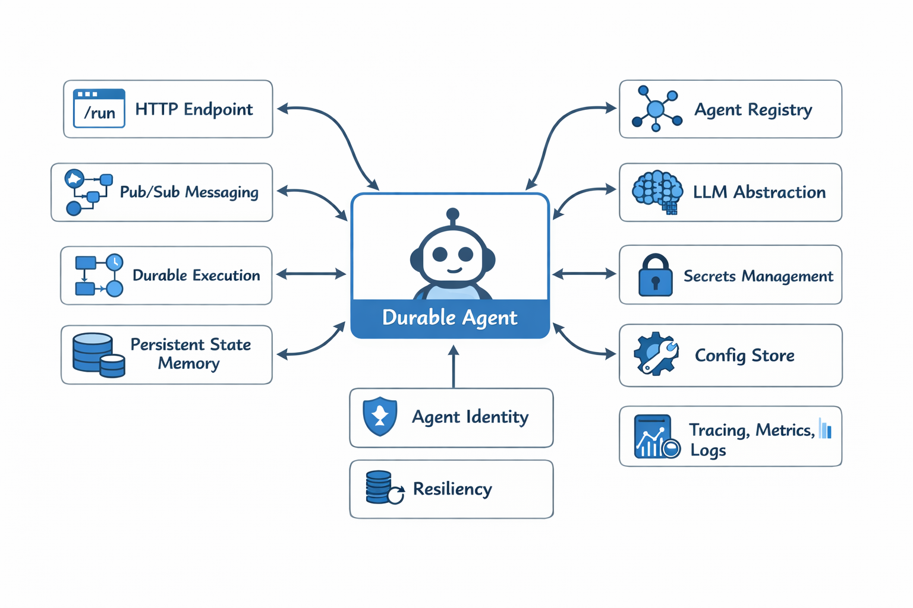
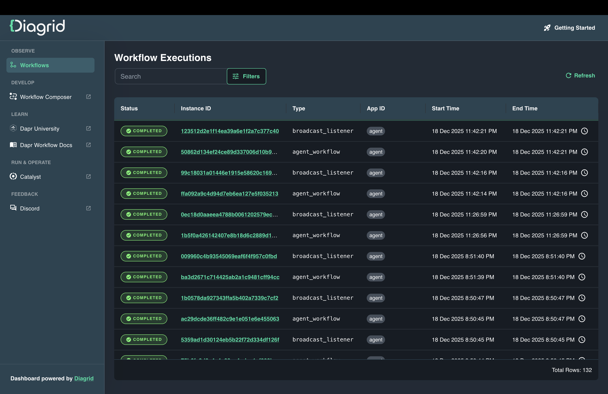
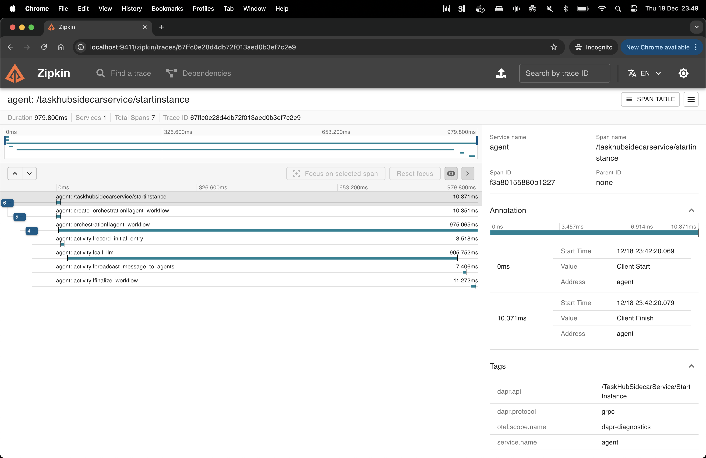
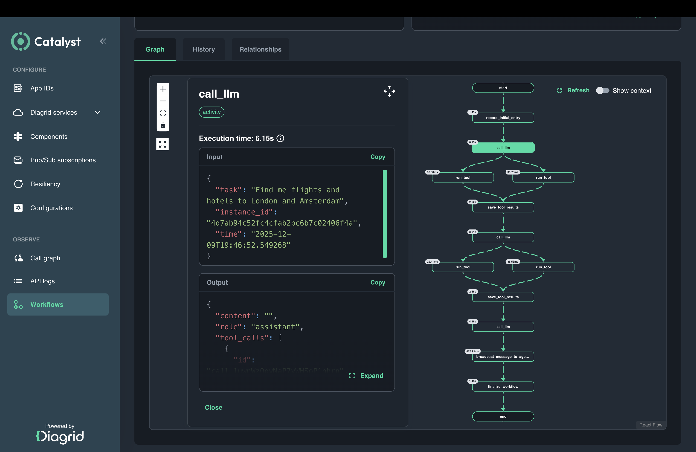

# Tiniest Durable Agent

A minimal, operationally production-ready, durable agent built with [Dapr Agents](https://diagrid.ws/dapr-agents-doc). This example shows how little code is required to build a durable and at the same time production-ready AI agent.




## Prerequisites
- [OpenAI API key](https://platform.openai.com/api-keys) or another supported LLM provider
- [Python 3.11+](https://www.python.org/downloads/)
- [uv](https://docs.astral.sh/uv/getting-started/installation/)
- [Docker](https://docs.docker.com/desktop/)

## Setup

### Install Dapr locally

On macOS:

```bash
brew install dapr/tap/dapr-cli
dapr init
```

For other platforms, see [https://docs.dapr.io/getting-started/install-dapr-selfhost/](https://docs.dapr.io/getting-started/install-dapr-selfhost/)

### Configure your LLM provider

Add your OpenAI or other LLM provider credentials to:

```
resources/agent-llm-provider.yaml
```

### Install dependencies

```bash
uv sync
```

## Run the tiniest Durable Agent (in embedded mode)

This is the complete durable agent implementation: [`durable_agent_minimal.py`](./durable_agent_minimal.py).

```python
from dapr_agents import DurableAgent
from dapr_agents.workflow.runners import AgentRunner

runner = AgentRunner()
agent = DurableAgent(name="Assistant")
print(runner.run_sync(agent, {"task": "Write a haiku about programming."}))
runner.shutdown()
```

Run the agent with a sidecar:

```bash
dapr run --app-id durable-agent-minimal --resources-path ./resources -- uv run durable_agent_minimal.py
```

This command starts a Dapr sidecar and runs the agent. The prompt triggers a durable workflow which prints the response, and completes.

Example output:

```log
== APP == user:
== APP == Write a haiku about programming.
== APP ==
--------------------------------------------------------------------------------
== APP ==
== APP == Assistant(assistant):
== APP == Lines of logic flow,
== APP == Silent thoughts in coded streams—
== APP == Dreams compile to life.
== APP ==
--------------------------------------------------------------------------------
== APP ==
```

## Run the tiniest Durable Agent (as a standalone app)

This is the complete service-style implementation: [`durable_agent_service.py`](./durable_agent_service.py).

```python
from dapr_agents import DurableAgent
from dapr_agents.workflow.runners import AgentRunner

runner = AgentRunner()
agent = DurableAgent(name="Assistant", system_prompt="You are a helpful assistant")

try:
    runner.subscribe(agent)
    runner.serve(agent, port=8001)
finally:
    runner.shutdown()
```

Run the agent as a long-running service:

```bash
dapr run -f tiny-durable-agent.yaml
```

## What this agent does

Despite its size, this agent:

- Exposes an HTTP endpoint at `http://localhost:8001/run`
- Subscribes to Redis via the [Dapr Pub/Sub API](https://docs.dapr.io/developing-applications/building-blocks/pubsub/) on `assistant.topic`
- Uses the [Dapr Conversation API](https://docs.dapr.io/developing-applications/building-blocks/conversation/) to decouple interaction with LLM providers
- Uses the [Dapr Workflow API](https://docs.dapr.io/developing-applications/building-blocks/workflow/) to execute agent logic durably
- Persists conversation history using the [Dapr State Store API](https://docs.dapr.io/developing-applications/building-blocks/state-management/)
- Registers itself into an agent registry for discovery by other agents
- Is assigned a workload identity based on SPIFFE via [Dapr's built-in mTLS](https://docs.dapr.io/concepts/security-concept/#identity) and identity system
- Supports automatic authentication between agents and callers via Dapr [sidecar-to-sidecar security](https://docs.dapr.io/concepts/security-concept/#authentication)
- Consumes configuration values from external configuration stores using the [Dapr Configuration API](https://docs.dapr.io/developing-applications/building-blocks/configuration/)
- Retrieves secrets such as LLM credentials using the [Dapr Secrets API](https://docs.dapr.io/developing-applications/building-blocks/secrets/)
- Emits distributed traces via [Dapr observability](https://docs.dapr.io/operations/observability/tracing/tracing-overview/) to Zipkin at `http://localhost:9411/`
- Exposes [Prometheus-compatible metrics](https://docs.dapr.io/operations/observability/metrics/metrics-overview/)
- Logs all [API interactions](https://docs.dapr.io/operations/troubleshooting/api-logs-troubleshooting/) with backing infrastructure such as Redis, Pub/Sub brokers, and LLM providers

### Capabilities not enabled in this example (but easily added)
 Identity, security, durability, observability, configuration, and integration with backing systems are provided uniformly by Dapr. The following Dapr capabilities are not enabled in this example, but can be added without changing the agent code:

- Adds retries, timeouts, and circuit breakers using the [Dapr Resiliency API](https://docs.dapr.io/developing-applications/building-blocks/resiliency/resiliency-overview/)
- Enables durable retries and compensation logic using the [Dapr Workflow API](https://docs.dapr.io/developing-applications/building-blocks/workflow/workflow-overview/)
- Enforces caller authorization and access control using [Dapr access control policies](https://docs.dapr.io/operations/security/app-api-token/) and [Dapr mTLS authorization](https://docs.dapr.io/operations/security/mtls/mtls-overview/)
- Uses secrets from external secret stores via the [Dapr Secrets API](https://docs.dapr.io/developing-applications/building-blocks/secrets/)
- Configures the agent using values from external configuration stores via the [Dapr Configuration API](https://docs.dapr.io/developing-applications/building-blocks/configuration/)

## Trigger the agent over HTTP

In a separate terminal:

```bash
curl -i -X POST http://localhost:8001/agent/run \
  -H "Content-Type: application/json" \
  -d '{"task": "Write a haiku about programming."}'
```

The response includes the workflow instance ID created for this request.

## Trigger the agent over Pub/Sub

Publish a prompt to the subscribed topic:

```bash
curl -i -X POST http://localhost:3500/v1.0/publish/agent-pubsub/assistant.topic \
  -H "Content-Type: application/json" \
  -d '{"task": "Write a haiku about programming."}'
```

Dapr confirms that the event was published.

## Examine workflow executions

Launch the Diagrid Dashboard in a separate terminal:

```bash
docker run -p 8080:8080 ghcr.io/diagridio/diagrid-dashboard:latest
```

View agent workflows at:

```
http://localhost:8080
```



## Examine agent traces in Zipkin

The Dapr CLI starts Zipkin by default. If Zipkin is not running:

```bash
docker run -d -p 9411:9411 openzipkin/zipkin
```

Then see the agent execution traces:

```
http://localhost:9411
```



## Examine Prometheus-compatible metrics

```
http://localhost:9090
```


## Workflow Visualizer

To see the agent's execution, including each step taken by the agent with inputs and outputs for every LLM and tool call, use the Workflow Visualizer in [Diagrid Catalyst](http://diagrid.io/catalyst).

After sign up to Catalyst, create a project:
```bash
diagrid project create tiny-durable-agent-project --deploy-managed-pubsub --deploy-managed-kv --enable-managed-workflow --use
```
Stop any locally running agent instances and run the agent with full agentic backend (workflow engine, pubsub, LLM API, storage) provided by Catalyst:

```bash
diagrid dev run -f tiny-durable-agent.yaml --approve
```

Access the Workflow Visualizer here [https://catalyst.diagrid.io/](https://catalyst.diagrid.io/) and trigger the agent as shown earlier over HTTP.



## Start with Dapr Agents

Start with Dapr Agents here: [Dapr Agents quick starts](https://github.com/dapr/dapr-agents)
