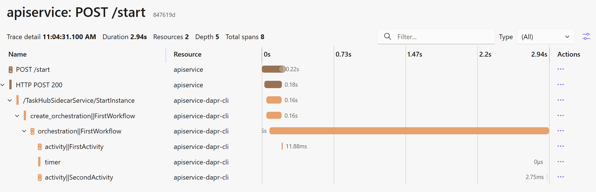
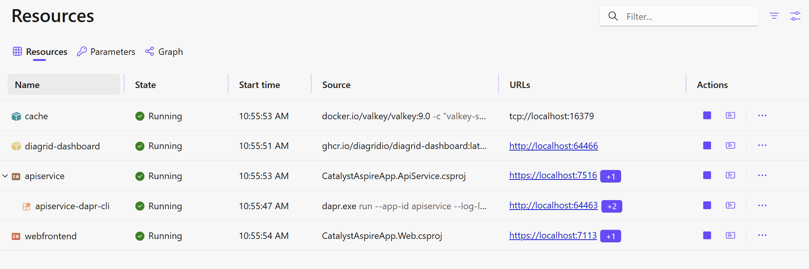
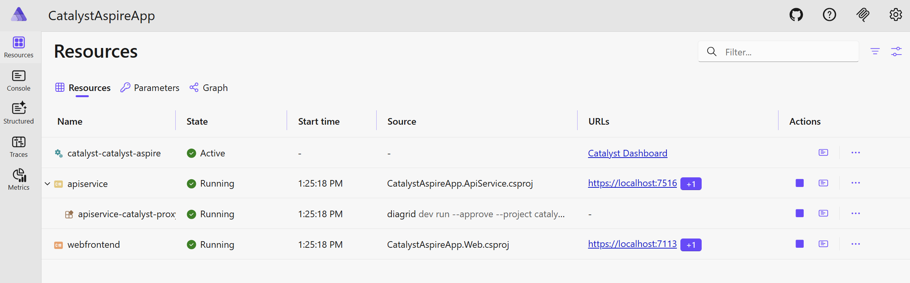
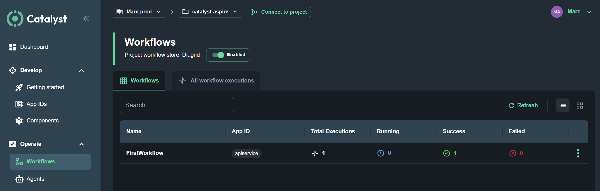
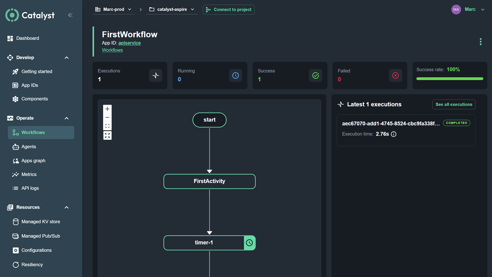
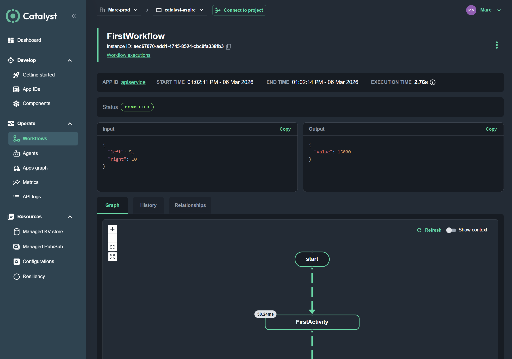

# CatalystAspireApp

An Aspire starter application with a Dapr workflow. This solution demonstrates how to use [Dapr Workflow](https://docs.dapr.io/developing-applications/building-blocks/workflow/workflow-overview/) with  Aspire orchestration.


There are two Aspire solutions:
- CatalystAspireApp-Start; this solution uses Dapr locally to run the workflows.
- CatalystAspireApp-Final; this solution uses Diagrid Catalyst to run the workflows by using the [Catalyst Aspire integration](https://github.com/diagrid-labs/catalyst-aspire).

The application consists of:

- **AppHost** — The Aspire orchestrator that configures Dapr sidecars, a Valkey state store, and the Diagrid dashboard.
- **ApiService** — A web API that registers and runs a Dapr workflow (`FirstWorkflow`) with two activities (`FirstActivity` and `SecondActivity`).
- **Web** — A Blazor frontend that connects to the API service.
- **ServiceDefaults** — Shared service configuration (OpenTelemetry, health checks, service discovery).

## Prerequisites

For running this locally with Dapr you need:
- A container runtime such as [Docker Desktop](https://www.docker.com/products/docker-desktop) or [Podman](https://podman.io/)
- [.NET 10](https://dotnet.microsoft.com/en-us/download)
- [Aspire CLI](https://aspire.dev/get-started/install-cli/)
- [Dapr](https://docs.dapr.io/getting-started/install-dapr-cli/)

For adding the Catalyst Aspire integration, you'll need:
- [A Diagrid Catalyst account](https://www.diagrid.io/catalyst)
- [Diagrid CLI](/references/catalyst/catalyst-cli-intro)

## Running the application in CatalystAspireApp-Start

```bash
aspire run
```






## Running the application in CatalystAspireApp-Start

```bash
aspire run
```

Use the Aspire Resources tab to navigate to the Catalyst Dashboard:



In Catalyst, use the workflow tab to navigate to the workflow view:







